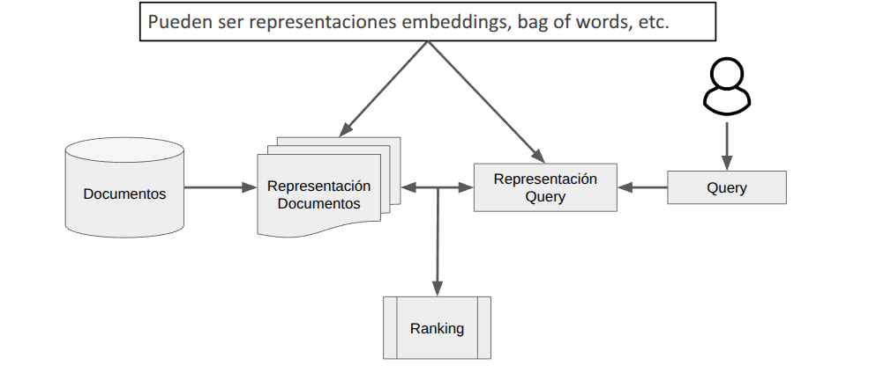

# Explicación del Benchmark y de criterios de evaluación para el Investigathon de YHat

## Introducción

LongMemEval es un benchmark diseñado para evaluar sistemas de memoria de largo plazo en asistentes conversacionales. A diferencia de tareas clásicas de QA, acá el foco está en medir **si un sistema puede recordar, actualizar, sintetizar y recuperar información dispersa en historiales extensos**.

En este documento explicamos:

- Cómo está formulado el benchmark original de LongMemEval.  
- Qué habilidades mide y cómo se construyen las instancias.  
- Cómo evaluamos en este track del Investigathón, incluyendo nuestro *own benchmark extension* con preguntas nuevas.  
- Qué deben entregar los equipos y cómo será evaluado.

---

## Version del Benchmark Utilizado

En esta competencia vamos a usar la version S de LongMemEval que tiene una secuencia de sesiones que llega a ~115k tokens en total

### Formulación

Cada instancia del benchmark es una **4-upla**:

\[
$(S, q, a)$
\]

donde:

- **S** es una secuencia de sesiones ordenadas cronológicamente:  
  
  $S \equiv [(t_1, S_1), (t_2, S_2), ..., (t_N, S_N)]$

- Cada **Sᵢ** es una interacción multi-turno entre usuario y asistente. Cada mensaje cuenta con un timestamp temporal  
- Cada sesión se puede descomponer en *rounds*: un mensaje del usuario seguido de uno del asistente.  
- **q** es la pregunta final.  
- **a** es la respuesta correcta (corta y concisa).

### ¿Cómo se evalúa?

- El sistema recibe el historial completo `S` el cual debe procesar de alguna manera (puede ser RAG como vamos a mostrar o cualquier sistema que se les ocurra).  
- Luego se le da la pregunta `q`.  
- Debe generar una respuesta que será evaluada por un LLM (ver sección Métricas).

---

## Qué mide LongMemEval

El benchmark evalúa cinco habilidades fundamentales:

### **1. Information Extraction (IE)**  
Recordar detalles específicos del historial, dichos por el usuario o por el asistente.

### **2. Multi-Session Reasoning (MR)**  
Integrar información de distintas sesiones para responder preguntas que requieren síntesis.

### **3. Knowledge Updates (KU)**  
Detectar y actualizar la información del usuario a medida que cambia en el tiempo.

### **4. Temporal Reasoning (TR)**  
Razonar sobre fechas, secuencias y eventos ordenados temporalmente.

### **5. Abstention (ABS)**  
Reconocer cuando una pregunta no puede ser respondida con la información disponible y devolver "I don’t know".

---

## Tipos de Preguntas

LongMemEval genera siete categorías principales:

- **Single-session-user**  
- **Single-session-assistant**  
- **Single-session-preference**
- **Multi-session** (MR)
- **Knowledge-update** (KU)
- **Temporal-reasoning** (TR)
- **Abstention** (30 preguntas diseñadas para medir no-alucinación)

Cada categoría captura un patrón distinto del comportamiento esperado de un asistente memorioso.

---

## Cómo se construye el benchmark original

El benchmark define 164 atributos organizados en:

- lifestyle  
- belongings  
- life events  
- situation context  
- demographic information  

### Background sampling  
Para cada atributo, un LLM genera un párrafo narrado desde la perspectiva del usuario.

### QA generation  
A partir del párrafo, otro modelo genera pares (pregunta, respuesta).  
Estas preguntas luego pasan por revisión humana para calidad y diversidad.

### 5.3 Evidence Session Construction
Los autores generan sesiones adicionales que contienen la evidencia necesaria para responder las preguntas, pero distribuidas y mezcladas con ruido conversacional realista.

### 5.4 History Compilation  
Se ensamblan todas las sesiones en orden temporal, formando historiales largos y complejos.

---

## Métricas del Benchmark

Dado que las respuestas son abiertas, no se usa exact match.  
El benchmark utiliza **LLM-as-a-judge**. Deben usar el mismo prompt dado en este repo
---

# Restricción de modelos permitidos

Cada equipo puede usar **cualquier modelo de hasta 4B parámetros** para ejecutar cualquier parte del sistema que lleve a la respuesta a la pregunta.

Esto incluye:

- Modelos locales (Qwen3-4B, Gemma-3-4B, etc.)  

El objetivo es evaluar **memoria y eficiencia**, no fuerza bruta ni modelos gigantes.

# Benchmark especial del Investigathón (muy importante)

Para este track, además del benchmark oficial, **generamos nuestro propio conjunto adicional** con 500 preguntas adicionales utilizando los historiales de las preguntas originales de las cuales les entregaremos:

### **✔ 250 nuevas preguntas con sus respuestas**  
Podran usar estas preguntas como set de evaluación para evaluar el score de su sistema

### **✔ Otras 250 preguntas, pero sin las respuestas**  
Este sera el set de held out que usaremos nosotros para evaluar la calidad de sus sistemas. 

### **Entrega OBLIGATORIA**  
Deben subir un archivo con las respuestas para estas 250 preguntas:

**📅 Fecha límite para la entrega de respuesta de set de HELD OUT:**  
**11/12 a las 16:00 (24hs antes de la final del 12/12)**
Vamos a enviarle en la proxima semana por mail los detalles de como enviarnos las respuestas

### **Evaluación**  
La evaluación la haremos automáticamente usando **GPT-5-mini** con el mismo prompt del `JudgeAgent` incluido en este repositorio.

Esto sirve para tener una medicion interna de la calidad de sus metodos.

Recomendamos usar el mismo modelo ustedes para la evaluacion. 

---

# Qué deben reportar los equipos

Los resultados de su investigación deben incluir al menos estas métricas:

### **1. Score**  
Exactitud promedio según el juez LLM.

### **2. Latencia**  
Tiempo promedio por pregunta.

### **3. Varianza de la latencia**  
Varianza en la latencia de los experimentos

### **4. AVG Context Length**  
Longitud promedio del contexto enviado al modelo por pregunta.  
Esto permite comparar:  
- métodos que recuperan poco (RAG)  
- métodos con compresión o resúmenes dinámicos

Incluyan estas métricas en sus tablas y gráficas.

---
# Baseline
Además de reportar las métricas principales, cada equipo debe incluir una comparación directa contra un baseline estándar de Retrieval-Augmented Generation (RAG) bajo las mismas restricciones (modelo ≤ 4B parámetros). Este repo brinda una implementacion de este RAG y pueden encontrar las instrucciones para correrlo en README.md.

Los tutores del evento no se hacen responsables por cualquier error que pueda haber en la implementación brindada para el RAG (por favor, avisen si encuentran alguno). La idea es que no usen el repositorio como una caja negra. Si existe algún error en el repositorio (si hay un error, no fue hecho adrede), los equipos son responsables por haber utilizado código incorrecto.

#  Criterios de Evaluación
Ademas del resultado final en el set de held out, se evaluara en los equipos el proceso completo de investigacion, desde la prolijidad hasta la creatividad de las ideas. 

---
